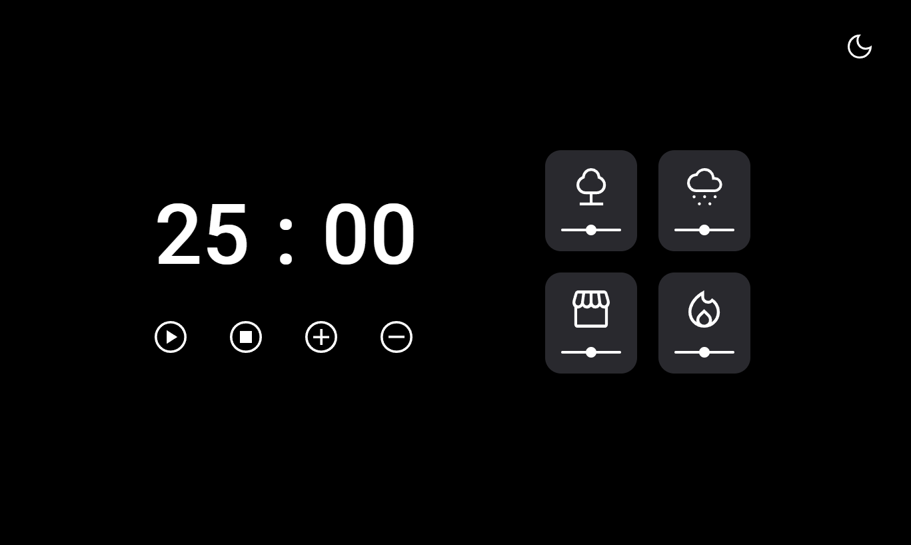

# Temporizador 2.0 Dark-Mode
 

> Explorer Desafio do Stage 5

Projeto feito utilizando os conceitos de HTML, CSS e JavaScript para criar um Temporizador com sons ambientes selecionáveis, ajuste de som e Dark-Mode através do curso da RocketSeat "Explorer".

## [🔗 Clique aqui para acessar o projeto](https://loren175.github.io/focus-timer-dark)

#

## 🚀 Tecnologias

- HTML
- CSS
- JavaScript
- Git e Github

## 📞 Contato

>rafael.loren175@gmail.com

>+55 (11) 99959-9140

## 👾 Discord

>rafas#7622